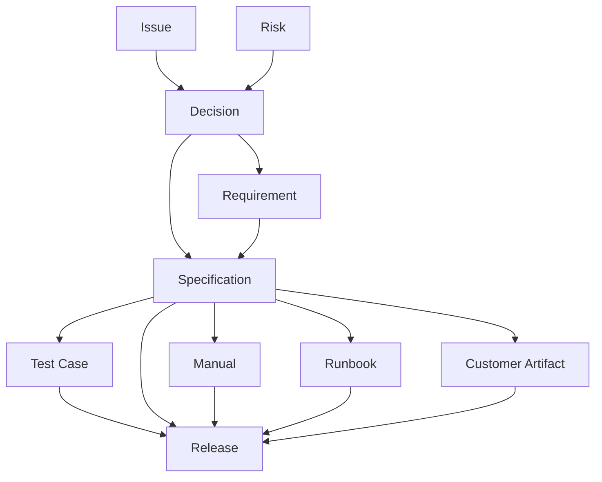
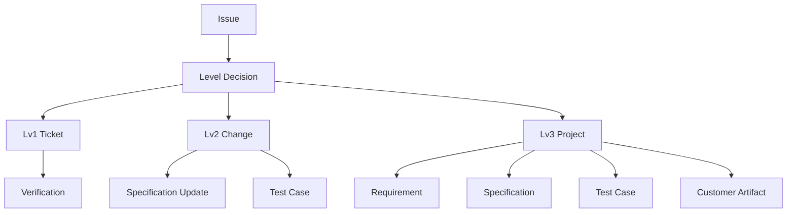

# Markdown Front Matter Oriented Migration Plan

## 1. Scope

This plan covers the migration of document management around the following script groups.

- .tools/scripts/document
- .tools/scripts/project
- .tools/scripts/shared

## 2. Core Policy

- One item per file for all specification, test, change, operation, and delivery docs.
- Front matter is the single source of traceability truth.
- Relationship direction is one-way from upstream to downstream references.
- Lists/matrices are generated artifacts, not manually maintained primary sources.

## 3. Relationship Direction Model

## 4. Level Handling Model

## 5. Front Matter Naming Rule

Use directional names instead of generic related_xxx.

- source_requirements
- source_decisions
- source_changes
- verifies_specs
- describes_specs
- operates_specs
- explains_specs
- includes_changes
- includes_specs
- includes_tests
- includes_manuals
- includes_runbooks
- includes_customer_artifacts

## 6. Migration Phases

1. Foundation
- Replace schema definitions for the new docs hierarchy and ID rules.
- Update script-side document type ordering.
- Add year-based ID generation in create and batch scripts.

2. Scaffolding
- Replace new-project folder structure with docs-first tree.
- Generate baseline README and operation guide stubs automatically.

3. Templates
- Add markdown templates under .tools/templates.
- Keep templates aligned with directional front matter names.

4. Validation and Generation
- Validate front matter against schema by prefix.
- Generate index/traceability reports into docs/90_generated.

## 7. Output Target

- docs/90_generated/

Examples:
- specification-to-test matrix
- specification-to-manual matrix
- isolated specifications
- isolated tests
- release coverage report

## 8. Risk and Mitigation

- Risk: Existing legacy directories remain mixed during migration.
  - Mitigation: New schema and scripts target the new docs paths; legacy docs can be migrated incrementally.

- Risk: Dual relationship definitions create contradictions.
  - Mitigation: Allow only downstream files to hold upstream IDs.

- Risk: ID format drift.
  - Mitigation: Enforce schema pattern and generator-based ID issuance.
