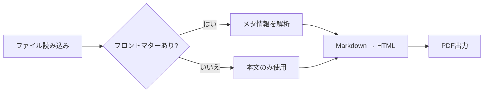
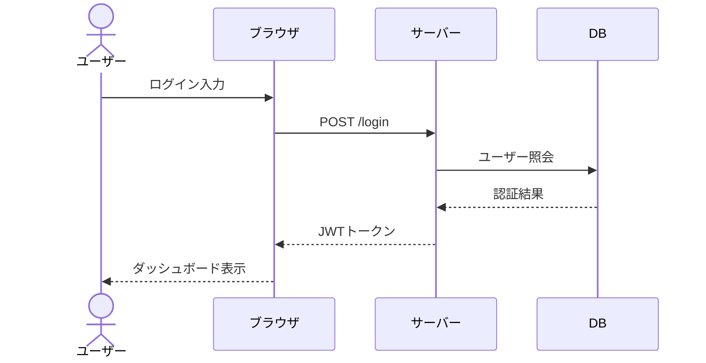

# 変換機能サンプル

このファイルは **Markdown → HTML / PDF 変換機能** の主要要素をまとめて確認するためのサンプルです。

---

# 見出しと自動番号

見出しは自動で番号が付与されます（設定によりON/OFF可能）。

## サブセクション

### さらに細かいセクション

本文中では `inline code` も表示できます。

---

# 基本のMarkdown要素

## リスト
- 箇条書き1
- 箇条書き2
  - ネスト1
  - ネスト2
- 箇条書き3

## 番号付きリスト
1. 手順1
2. 手順2
3. 手順3

## 引用
> これは引用テキストです。
> 複数行にも対応します。

## 強調

**太字テキスト** と *斜体テキスト* を組み合わせて表示できます。

---

# コードブロック

インライン: `const x = 42;`

```javascript
// JavaScriptサンプル
function greet(name) {
    return `Hello, ${name}!`;
}

console.log(greet("World"));
```

```bash
# シェルコマンド
node .tools/scripts/convert/build.mjs input.md
```

---

# Mermaid

:::figure width=80%

Markdown変換パイプラインのフローチャート
:::

:::figure width=80%

ログイン処理のシーケンス図
:::


---

# 表（Markdown）

| ID  | 名前       | 役割         | ステータス |
| --- | ---------- | ------------ | ---------- |
| 001 | 山田 太郎  | 管理者       | 有効       |
| 002 | 鈴木 花子  | 一般ユーザー | 有効       |
| 003 | 田中 一郎  | 監査担当     | 無効       |

---

# 参照（id + ref）

表は {{ref:tbl-ref-users}} のとおりです。図は [[ref:fig-ref-overview]] を参照してください。

:::table id=tbl-ref-users
利用者ID付きユーザー一覧

| ID  | 名前       | 区分 |
| --- | ---------- | ---- |
| 101 | 高橋 次郎  | A    |
| 102 | 佐藤 三郎  | B    |
:::

:::figure id=fig-ref-overview width=55%

参照ID付きの概要図
:::

---

# DSLブロック

:::warning
注意: 本番環境へ適用する前に、必ず検証環境で動作確認してください。
:::

:::center
**中央揃えテキスト**
:::

:::right
2026年6月12日
:::

:::large
大きい文字のサンプル
:::

:::red
**エラー:** 必須入力が不足しています。
:::

---

# ページ区切り

:::pagebreak
:::

# ページ区切り後

このセクションは新しいページから始まります。
