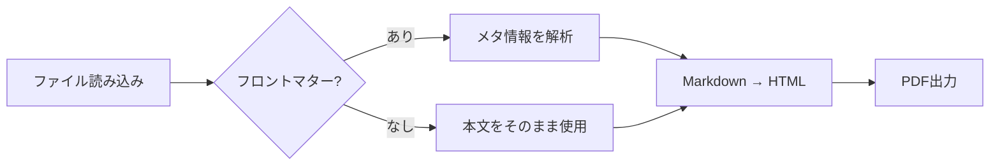
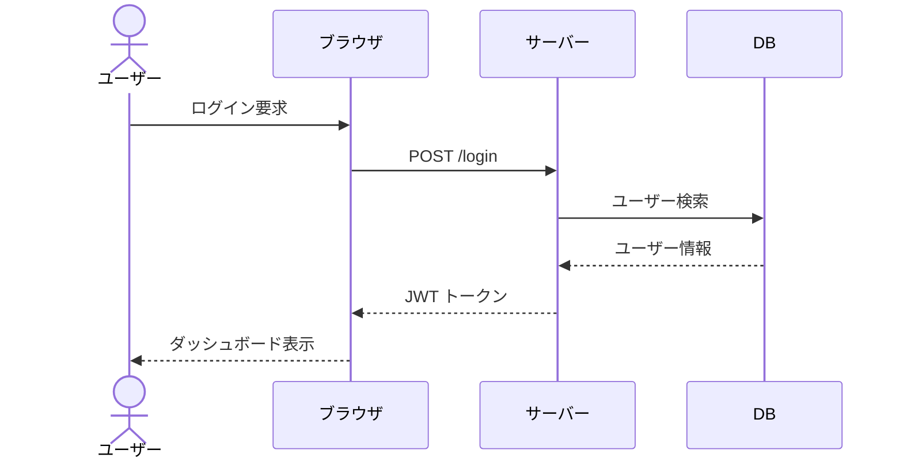
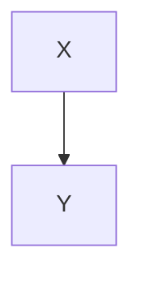

# 変換機能サンプル

本ドキュメントは **Markdown → HTML / PDF 変換機能** の全要素をひとつのファイルで確認するためのサンプルです。

---

# 見出しの自動番号

見出しには自動で番号が付与されます（`style.json` の `heading.numbering` で制御）。

## サブセクション

### さらに深いセクション

本文テキストです。`inline code` もこのように表示されます。

単一改行はスペース扱いになります（段落は変わらない）。
この行は上の行と同じ段落です。

行末に `\` で改行できます。\
ここから新しい行になります。

行末に半角スペース2つでも同じ効果です。  
ここから新しい行になります。

空行を挟むと段落が分かれます。

---

# 基本テキスト要素

## リスト

- 箇条書き1
- 箇条書き2
  - ネスト1
  - ネスト2
- 箇条書き3

## 番号付きリスト

1. 手順1
2. 手順2
3. 手順3

## 引用

> これは引用テキストです。
> 複数行にまたがることもできます。

## 区切り線

---

## リンクと強調

**太字テキスト**、*斜体テキスト*、~~打ち消し線~~

---

# コードブロック

インライン: `const x = 42;`

ブロック:

```javascript
// JavaScriptのサンプル
function greet(name) {
    return `Hello, ${name}!`;
}

console.log(greet("World"));
```

```bash
# シェルコマンド
node .tools/scripts/convert/build.mjs input.md
```

---


# Mermaidグラフ

図番号・キャプションを付ける場合は、`:::figure` で Mermaid ブロック全体を囲みます。

## フローチャート（図番号・キャプション付き）

:::figure width=80%

Markdown変換パイプラインのフローチャート
:::

## シーケンス図（図番号・キャプション付き）

:::figure width=80%

ログイン処理のシーケンス図
:::

## キャプションなし（図番号のみ）

:::figure

:::

---

# テーブル（標準Markdown）

| ID  | 名前     | 役割         | ステータス |
| --- | -------- | ------------ | ---------- |
| 001 | 山田太郎 | 管理者       | 有効       |
| 002 | 鈴木花子 | 一般ユーザー | 有効       |
| 003 | 田中一郎 | 閲覧者       | 無効       |

---

# 図表参照（id + ref）

本文中で図表番号を固定文字で書かずに、ref記法で参照できます。

表は {{ref:tbl-ref-users}} に示す通りです。図は [[ref:fig-ref-overview]] の通りです。

:::table id=tbl-ref-users
参照ID付きユーザー一覧

| ID  | 名前     | 区分 |
| --- | -------- | ---- |
| 101 | 佐藤花子 | A    |
| 102 | 高橋次郎 | B    |
:::

:::figure id=fig-ref-overview width=55%

参照ID付きの概要図
:::

---

# 独自DSL ブロック

以下は `000_schema/convert/dsl.json` で定義されたブロックです。

## warning（警告）

デフォルト（`style.json` の `warningMaxWidth` が適用される）:

:::warning
この操作は元に戻せません。実行前に必ずバックアップを取得してください。
:::

幅を指定する場合は `width=` 属性で上書き可能。`style.json` の設定値:
- `warningMaxWidth` — 最大幅（デフォルト `100%`）
- `colors.warningBg` — 背景色
- `colors.warningBorder` — 左ボーダー色
- `spacing` 系は `dsl.json` の `padding` / `margin` で直接調整

幅 60% 指定:

:::warning width=60%
幅を 60% に絞ったwarningブロックです。
:::

幅 40em 指定:

:::warning width=40em
固定幅（40em）のwarningブロックです。短いテキストでも枠が広がりすぎません。
:::

## center（中央揃え）

:::center
**中央に配置されたテキストです**
:::

## right（右寄せ）

:::right
作成日：2026年5月17日
:::

## large（大きい文字）

:::large
重要なお知らせ
:::

## red（赤文字）

:::red
**エラー：** 接続がタイムアウトしました。
:::

## figure（図 — internal起点・デフォルトサイズ）
`assetsInternal` を指定すると、そのフォルダを起点に相対パスを解決します。
:::figure

システム構成の概要図
:::

## figure（図 — internal起点・幅指定）
:::figure width=60%

幅を60%に指定した図
:::

ピクセル指定も可能です。
:::figure width=400px height=300px

400×300px 指定の図
:::

## figure（図 — 基準パス未指定時）
`assetsInternal` を省略した場合は、変換する Markdown ファイルの配置フォルダを起点に相対パスを解決します。

## figure（図 — 配置指定）
`align=` 属性で図の水平配置を指定できます。省略時は `center`（中央揃え）です。

左揃え：
:::figure width=40% align=left

左揃えで表示した図
:::

中央揃え（デフォルト）：
:::figure width=40% align=center

中央揃えで表示した図
:::

右揃え：
:::figure width=40% align=right

右揃えで表示した図
:::

## table（キャプション付き表）

:::table
ユーザー一覧

| ID  | 名前     | 権限   |
| --- | -------- | ------ |
| 001 | 山田太郎 | 管理者 |
| 002 | 鈴木花子 | 一般   |
:::

テーブルのセル内で改行するには `<br>` を直接書きます。

| 項目   | 内容                      |
| ------ | ------------------------- |
| 対応OS | Windows<br>macOS<br>Linux |
| 備考   | 1行目<br>2行目            |

---

# ページ区切り

以下の行でPDF上のページが切り替わります。

:::pagebreak
:::

# ページ区切り後のページ

ページ区切り後のコンテンツです。PDF で確認すると、このセクションが新しいページに始まります。

## まとめ

このサンプルで確認できる要素：

| カテゴリ     | 要素                                                                      |
| ------------ | ------------------------------------------------------------------------- |
| Markdown標準 | 見出し・リスト・表・コード・引用・区切り線                                |
| 自動番号     | h1〜h3 に章番号が付く                                                     |
| DSL ブロック | warning / center / right / large / red                                    |
| DSL 図       | figure（幅・高さ指定対応、キャプション付き）                              |
| 図表参照     | id付き figure/table を ref記法（ref:xxx）で参照                           |
| 図パス制御   | assetsInternal 指定時はそのパス起点、未指定時は Markdown 配置フォルダ起点 |
| DSL 表       | table（キャプション付き）                                                 |
| Mermaid      | flowchart / sequenceDiagram など                                          |
| ページ制御   | pagebreak                                                                 |
| PDF 設定     | page.json（用紙・余白）                                                   |
| スタイル設定 | style.json（フォント・色・スペーシング）                                  |
