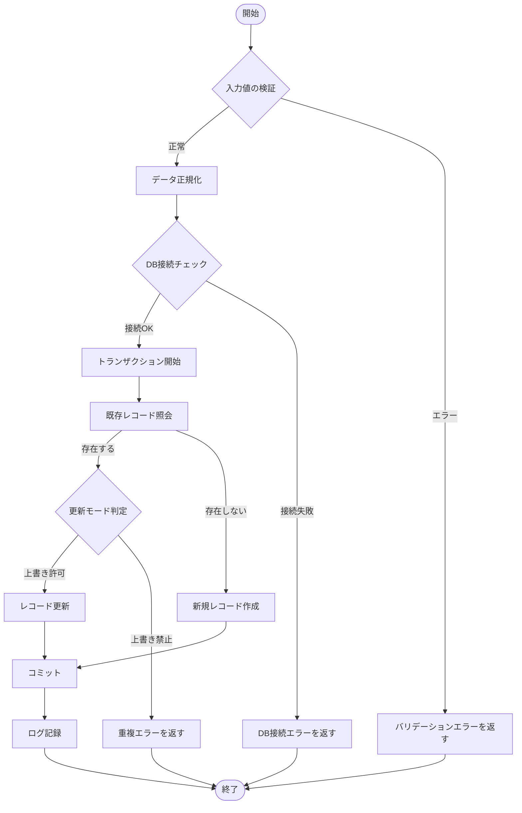
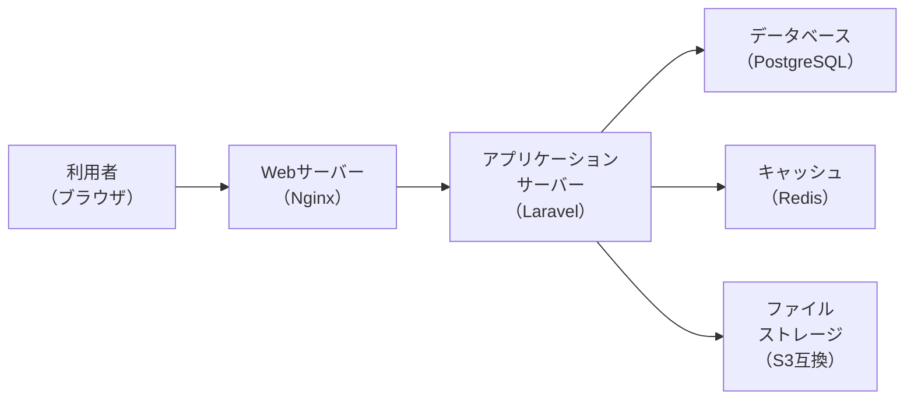
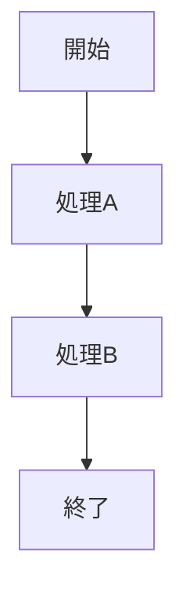
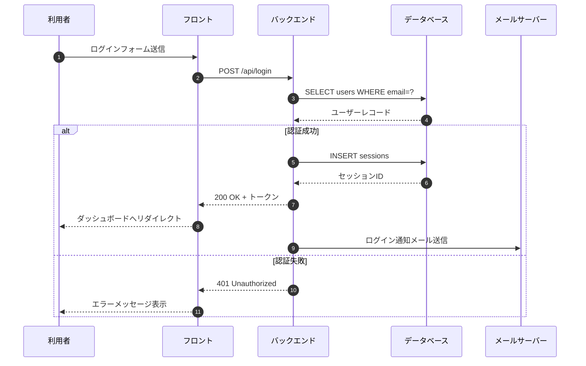
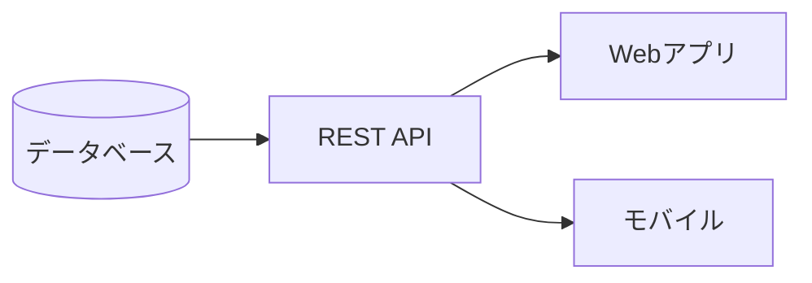

# Mermaid 検証

## 複雑なフローチャート（深いネスト）

深いネストと多数ノードで文字がめり込まないかを確認する。

フロー図1 複雑なフローチャート

## ノード内改行の確認

` ` でノード内を改行しても文字が重ならないかを確認する。

フロー図2 ノード内改行テスト

## 横幅指定（70%）

`%%width: 70%%` ディレクティブで図の横幅を70%に制限できることを確認する。

フロー図3 70%幅指定

## 横幅指定（50%）

フロー図4 50%幅指定

## シーケンス図（複数参加者）

フロー図5 ログインシーケンス

---

# テーブル検証

## 多カラム・多行テーブル

ヘッダーが1行に収まるかを確認する。

| ID    | 機能名             | 担当者   | 優先度 | ステータス | 開始日     | 完了日     | 備考                 |
| ----- | ------------------ | -------- | ------ | ---------- | ---------- | ---------- | -------------------- |
| F-001 | ユーザー認証       | 田中太郎 | 高     | 完了       | 2026-04-01 | 2026-04-15 | OAuth2対応含む       |
| F-002 | 施設管理CRUD       | 鈴木花子 | 高     | 完了       | 2026-04-10 | 2026-04-28 | 画像アップロード含む |
| F-003 | 児童スケジュール   | 佐藤次郎 | 中     | 進行中     | 2026-04-20 | 2026-05-20 | カレンダーUI要件あり |
| F-004 | 日報作成・編集     | 田中太郎 | 中     | 進行中     | 2026-05-01 | 2026-05-31 | -                    |
| F-005 | 月次レポート出力   | 高橋三郎 | 低     | 未着手     | 2026-06-01 | 2026-06-30 | PDF出力要件あり      |
| F-006 | メール通知         | 鈴木花子 | 中     | 未着手     | 2026-05-15 | 2026-05-30 | テンプレート設計中   |
| F-007 | 権限管理           | 高橋三郎 | 高     | レビュー中 | 2026-04-15 | 2026-05-10 | ロールベース制御     |
| F-008 | 請求書生成         | 佐藤次郎 | 低     | 未着手     | 2026-07-01 | 2026-07-31 | 外部API連携          |
| F-009 | データエクスポート | 田中太郎 | 低     | 未着手     | 2026-07-15 | 2026-08-15 | CSV・Excel形式       |
| F-010 | 監査ログ           | 高橋三郎 | 中     | 未着手     | 2026-06-15 | 2026-06-30 | GDPR対応             |

## テーブルセル内の段落マージン確認

セル内に複数行のテキストがある場合、不要なマージンがつかないことを確認する。

| 項目       | 内容                                                                                                           |
| ---------- | -------------------------------------------------------------------------------------------------------------- |
| 概要       | このセルは通常の1行テキストです。                                                                              |
| 詳細説明   | このセルには長いテキストが入ります。テーブルのセル幅に合わせて折り返されますが、段落マージンは付与されません。 |
| ステータス | 正常                                                                                                           |

---

# 本文テキスト行間確認

## 行間（lineHeightBody）の確認

以下の段落で、body のみ行間が適用され、見出しには別の行間が使われていることを確認する。

これは通常の本文テキストです。行間は `lineHeightBody` で制御されています。日本語の長文でも読みやすいよう適切な行間が設定されています。この文は行間の確認のためにある程度の長さになっています。折り返しが発生するくらいの長さを想定しています。

次の段落との間隔は `paragraphGap` で制御されています。

この段落は2つ目です。段落間の隙間が広すぎず狭すぎない適切な値になっているかを目視で確認してください。

## 見出しの行間確認

見出しの行間は `lineHeightHeading` で別途制御されています。長い見出しが折り返されたときに文字が詰まりすぎず、かつ本文より引き締まった印象になることを確認する。

---

# 複合確認

## Mermaidと表の混在

フロー図6 システム構成（60%幅）

上図のAPIエンドポイント一覧：

| エンドポイント   | メソッド | 説明             | 認証       |
| ---------------- | -------- | ---------------- | ---------- |
| /api/users       | GET      | ユーザー一覧取得 | 要         |
| /api/users/{id}  | GET      | ユーザー詳細取得 | 要         |
| /api/users       | POST     | ユーザー作成     | 要         |
| /api/users/{id}  | PUT      | ユーザー更新     | 要         |
| /api/users/{id}  | DELETE   | ユーザー削除     | 管理者のみ |
| /api/auth/login  | POST     | ログイン         | 不要       |
| /api/auth/logout | POST     | ログアウト       | 要         |
