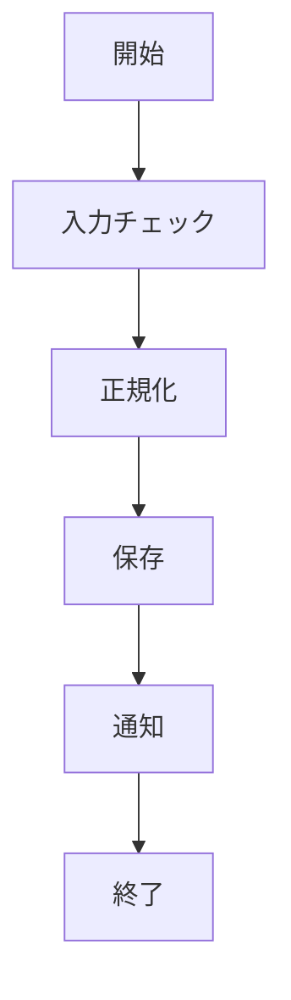

# はじめに

このサンプルは、次の2点を確認するためのファイルです。

- `tocManual` で目次を手入力できること
- コードブロックの先頭に `%%fig: ...%%` を書いた場合のみ図番号が付くこと

# 手入力目次の設定

このファイルは `toc: true` かつ `tocManual` を指定しています。
そのため、見出しからの自動目次ではなく、`tocManual` の内容が優先されます。

# コードブロック図番号

## 図番号あり（ディレクティブあり）

```js
%%fig: 利用者名の正規化処理%%
function normalizeUserName(name) {
    return String(name).trim().replace(/\s+/g, " ");
}
```

## 図番号なし（ディレクティブなし）

```js
function toDisplayDate(isoDate) {
    const d = new Date(isoDate);
    return `${d.getFullYear()}/${d.getMonth() + 1}/${d.getDate()}`;
}
```

# Mermaidと手入力目次の併用


業務フロー図（手入力目次サンプル）

## Mermaid高さ指定（height）

先頭に `%%height: 60mm%%` を書くと、図の縦方向サイズ上限を指定できます。



業務フロー図（height指定サンプル）

# 長いテーブルの改ページ検証

このセクションは、表が1ページに収まりきらない場合の挙動を確認するためのサンプルです。

## 改修内容の説明

今回の改修では、印刷時の改ページルールを次の方針に変更しています。

- 表全体の分割禁止はやめ、長い表はページ分割を許可する
- 表番号（キャプション）直後で改ページされにくくする
- ページ分割時もヘッダー行を繰り返し表示する

これにより、「表番号だけ前ページに残って表本体が次ページへ行く」崩れを軽減できます。

## 長いテーブル（改ページ確認用）

:::table fontSize=13px colRatio=1,1,3,1,1,1,1,1,2
機能一覧（長い表・表番号付き改ページ確認）

| No. | 機能ID | 機能名                 | 担当者 | 優先度 | ステータス | 開始日     | 完了予定日 | 備考             |
| --- | ------ | ---------------------- | ------ | ------ | ---------- | ---------- | ---------- | ---------------- |
| 1   | F-001  | 利用者管理             | 田中   | 高     | 完了       | 2026-04-01 | 2026-04-10 | 初期実装         |
| 2   | F-002  | 施設管理               | 鈴木   | 高     | 完了       | 2026-04-03 | 2026-04-12 | CRUD対応         |
| 3   | F-003  | 権限管理               | 佐藤   | 高     | 進行中     | 2026-04-05 | 2026-05-01 | RBAC整理         |
| 4   | F-004  | スケジュール           | 高橋   | 中     | 進行中     | 2026-04-07 | 2026-05-08 | 月表示追加       |
| 5   | F-005  | 日報作成               | 伊藤   | 中     | 進行中     | 2026-04-10 | 2026-05-12 | 自動保存         |
| 6   | F-006  | 日報一覧               | 渡辺   | 中     | 完了       | 2026-04-11 | 2026-04-25 | 検索条件追加     |
| 7   | F-007  | 月次集計               | 山本   | 中     | 未着手     | 2026-05-01 | 2026-05-31 | 集計ロジック検討 |
| 8   | F-008  | 請求書出力             | 中村   | 低     | 未着手     | 2026-05-03 | 2026-06-10 | PDF出力          |
| 9   | F-009  | メール通知             | 小林   | 中     | 進行中     | 2026-04-20 | 2026-05-20 | テンプレート整備 |
| 10  | F-010  | 監査ログ               | 加藤   | 中     | 未着手     | 2026-05-10 | 2026-06-01 | 監査要件対応     |
| 11  | F-011  | CSV出力                | 吉田   | 低     | 未着手     | 2026-05-12 | 2026-06-05 | 文字コード検討   |
| 12  | F-012  | Excel出力              | 山田   | 低     | 未着手     | 2026-05-15 | 2026-06-15 | 罫線スタイル     |
| 13  | F-013  | API認証                | 松本   | 高     | 完了       | 2026-04-02 | 2026-04-18 | JWT導入          |
| 14  | F-014  | APIレート制限          | 井上   | 中     | 進行中     | 2026-04-22 | 2026-05-18 | Redis利用        |
| 15  | F-015  | 障害通知               | 木村   | 中     | 進行中     | 2026-04-24 | 2026-05-25 | Slack連携        |
| 16  | F-016  | 二段階認証             | 林     | 高     | 未着手     | 2026-05-18 | 2026-06-20 | SMS検証          |
| 17  | F-017  | パスワード再設定       | 清水   | 中     | 完了       | 2026-04-14 | 2026-04-28 | トークン方式     |
| 18  | F-018  | お知らせ管理           | 阿部   | 低     | 進行中     | 2026-04-28 | 2026-05-26 | 公開期間対応     |
| 19  | F-019  | 添付ファイル管理       | 森     | 中     | 進行中     | 2026-04-30 | 2026-05-30 | 容量制限         |
| 20  | F-020  | 画像最適化             | 池田   | 低     | 未着手     | 2026-05-20 | 2026-06-25 | 圧縮率調整       |
| 21  | F-021  | ログイン履歴           | 橋本   | 中     | 完了       | 2026-04-09 | 2026-04-21 | IP記録           |
| 22  | F-022  | 利用統計ダッシュボード | 山崎   | 低     | 進行中     | 2026-05-05 | 2026-06-05 | グラフ追加       |
| 23  | F-023  | バックアップ管理       | 石井   | 高     | 進行中     | 2026-04-26 | 2026-05-28 | 定期実行         |
| 24  | F-024  | 復旧手順ガイド         | 小川   | 中     | 未着手     | 2026-05-25 | 2026-06-30 | Runbook整備      |
| 25  | F-025  | 外部連携API            | 前田   | 高     | 未着手     | 2026-06-01 | 2026-07-10 | 認可方式検討     |
| 26  | F-026  | webhook受信            | 岡田   | 中     | 未着手     | 2026-06-03 | 2026-07-01 | 冪等性対応       |
| 27  | F-027  | 監視アラート           | 藤田   | 中     | 進行中     | 2026-05-02 | 2026-05-29 | 閾値調整         |
| 28  | F-028  | システム設定画面       | 後藤   | 低     | 進行中     | 2026-05-07 | 2026-06-02 | UI調整           |
| 29  | F-029  | データ移行ツール       | 長谷川 | 高     | 未着手     | 2026-06-05 | 2026-07-15 | 変換仕様作成     |
| 30  | F-030  | 稼働レポート           | 村上   | 低     | 未着手     | 2026-06-10 | 2026-07-20 | 帳票フォーマット |
:::

## colWidths 指定サンプル

`colWidths` を使うと、列幅を直接指定できます（% や px をそのまま記述可能）。

:::table fontSize=12px colWidths=20%,50%,30%
担当者別タスク概要（colWidths指定例）

| 担当者 | 主担当機能                  | 進捗   |
| ------ | --------------------------- | ------ |
| 田中   | 利用者管理 / 認証 / CSV出力 | 進行中 |
| 鈴木   | 施設管理 / メール通知       | 進行中 |
| 佐藤   | 権限管理 / スケジュール     | 未着手 |
:::
