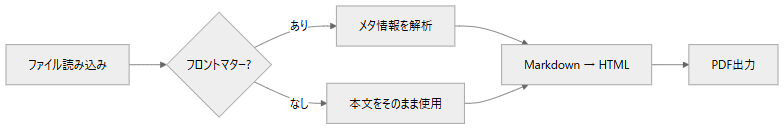
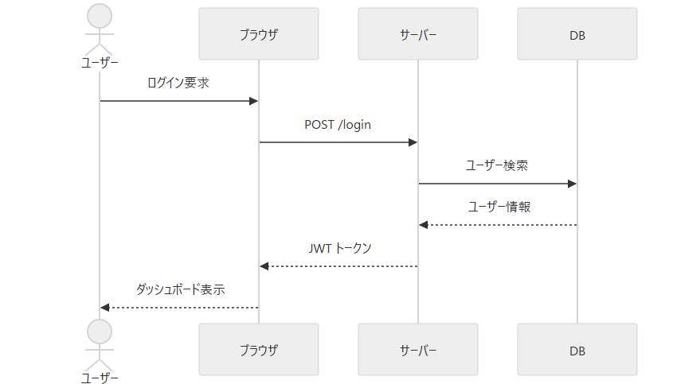
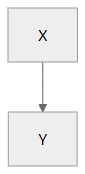

<!-- Generated from sample.docx by build_from_word.mjs -->

# 1\. 変換機能サンプル

本ドキュメントは **Markdown → HTML / PDF 変換機能** の全要素をひとつのファイルで確認するためのサンプルです。

# 2\. 見出しの自動番号

見出しには自動で番号が付与されます（style.json の heading.numbering で制御）。

## 2.1. サブセクション

### 2.1.1. さらに深いセクション

本文テキストです。inline code もこのように表示されます。

単一改行はスペース扱いになります（段落は変わらない）。 この行は上の行と同じ段落です。

行末に \\ で改行できます。  
ここから新しい行になります。

行末に半角スペース2つでも同じ効果です。  
ここから新しい行になります。

空行を挟むと段落が分かれます。

# 3\. 基本テキスト要素

## 3.1. リスト

-   箇条書き1
-   箇条書き2
    -   ネスト1
    -   ネスト2
-   箇条書き3

## 3.2. 番号付きリスト

1.  手順1
2.  手順2
3.  手順3

## 3.3. 引用

これは引用テキストです。 複数行にまたがることもできます。

## 3.4. 区切り線

## 3.5. リンクと強調

**太字テキスト**、斜体テキスト、打ち消し線

# 4\. コードブロック

インライン: const x = 42;

ブロック:

// JavaScriptのサンプル

function greet(name) {

return \`Hello, ${name}!\`;

}

console.log(greet("World"));

\# シェルコマンド

node .tools/scripts/convert/build.mjs input.md

# 5\. Mermaidグラフ

図番号・キャプションを付ける場合は、:::figure で Mermaid ブロック全体を囲みます。

## 5.1. フローチャート（図番号・キャプション付き）

図5.1 Markdown変換パイプラインのフローチャート

## 5.2. シーケンス図（図番号・キャプション付き）

図5.2 ログイン処理のシーケンス図

## 5.3. キャプションなし（図番号のみ）

# 6\. テーブル（標準Markdown）

<table><tbody><tr><td>
ID
</td><td>
名前
</td><td>
役割
</td><td>
ステータス
</td></tr><tr><td>
001
</td><td>
山田太郎
</td><td>
管理者
</td><td>
有効
</td></tr><tr><td>
002
</td><td>
鈴木花子
</td><td>
一般ユーザー
</td><td>
有効
</td></tr><tr><td>
003
</td><td>
田中一郎
</td><td>
閲覧者
</td><td>
無効
</td></tr></tbody></table>

# 7\. 図表参照（id + ref）

本文中で図表番号を固定文字で書かずに、ref記法で参照できます。

表は 表7.1 に示す通りです。図は 図7.1 の通りです。

参照ID付きユーザー一覧

<table><tbody><tr><td>
ID
</td><td>
名前
</td><td>
区分
</td></tr><tr><td>
101
</td><td>
佐藤花子
</td><td>
A
</td></tr><tr><td>
102
</td><td>
高橋次郎
</td><td>
B
</td></tr></tbody></table>

図5.3 参照ID付きの概要図

# 8\. 独自DSL ブロック

以下は 000\_schema/convert/dsl.json で定義されたブロックです。

## 8.1. warning（警告）

デフォルト（style.json の warningMaxWidth が適用される）:

この操作は元に戻せません。実行前に必ずバックアップを取得してください。

幅を指定する場合は width= 属性で上書き可能。style.json の設定値:

-   warningMaxWidth — 最大幅（デフォルト 100%）
-   colors.warningBg — 背景色
-   colors.warningBorder — 左ボーダー色
-   spacing 系は dsl.json の padding / margin で直接調整

幅 60% 指定:

幅を 60% に絞ったwarningブロックです。

幅 40em 指定:

固定幅（40em）のwarningブロックです。短いテキストでも枠が広がりすぎません。

## 8.2. center（中央揃え）

**中央に配置されたテキストです**

## 8.3. right（右寄せ）

作成日：2026年5月17日

## 8.4. large（大きい文字）

重要なお知らせ

## 8.5. red（赤文字）

**エラー：** 接続がタイムアウトしました。

## 8.6. figure（図 — internal起点・デフォルトサイズ）

assetsInternal を指定すると、そのフォルダを起点に相対パスを解決します。

図6.1 システム構成の概要図

## 8.7. figure（図 — internal起点・幅指定）

図6.2 幅を60%に指定した図

ピクセル指定も可能です。

図6.3 400×300px 指定の図

## 8.8. figure（図 — 基準パス未指定時）

assetsInternal を省略した場合は、変換する Markdown ファイルの配置フォルダを起点に相対パスを解決します。

## 8.9. figure（図 — 配置指定）

align= 属性で図の水平配置を指定できます。省略時は center（中央揃え）です。

左揃え：

図6.4 左揃えで表示した図

中央揃え（デフォルト）：

図6.5 中央揃えで表示した図

右揃え：

図6.6 右揃えで表示した図

## 8.10. table（キャプション付き表）

表6.1 ユーザー一覧

<table><tbody><tr><td>
ID
</td><td>
名前
</td><td>
権限
</td></tr><tr><td>
001
</td><td>
山田太郎
</td><td>
管理者
</td></tr><tr><td>
002
</td><td>
鈴木花子
</td><td>
一般
</td></tr></tbody></table>

テーブルのセル内で改行するには を直接書きます。

<table><tbody><tr><td>
項目
</td><td>
内容
</td></tr><tr><td>
対応OS
</td><td>
Windows

 

macOS

 

Linux
</td></tr><tr><td>
備考
</td><td>
1行目

 

2行目
</td></tr></tbody></table>

# 9\. ページ区切り

以下の行でPDF上のページが切り替わります。

# 10\. ページ区切り後のページ

ページ区切り後のコンテンツです。PDF で確認すると、このセクションが新しいページに始まります。

## 10.1. まとめ

このサンプルで確認できる要素：

<table><tbody><tr><td>
カテゴリ
</td><td>
要素
</td></tr><tr><td>
Markdown標準
</td><td>
見出し・リスト・表・コード・引用・区切り線
</td></tr><tr><td>
自動番号
</td><td>
h1〜h3 に章番号が付く
</td></tr><tr><td>
DSL ブロック
</td><td>
warning / center / right / large / red
</td></tr><tr><td>
DSL 図
</td><td>
figure（幅・高さ指定対応、キャプション付き）
</td></tr><tr><td>
図表参照
</td><td>
id付き figure/table を ref記法（ref:xxx）で参照
</td></tr><tr><td>
図パス制御
</td><td>
assetsInternal 指定時はそのパス起点、未指定時は Markdown 配置フォルダ起点
</td></tr><tr><td>
DSL 表
</td><td>
table（キャプション付き）
</td></tr><tr><td>
Mermaid
</td><td>
flowchart / sequenceDiagram など
</td></tr><tr><td>
ページ制御
</td><td>
pagebreak
</td></tr><tr><td>
PDF 設定
</td><td>
page.json（用紙・余白）
</td></tr><tr><td>
スタイル設定
</td><td>
style.json（フォント・色・スペーシング）
</td></tr></tbody></table>
