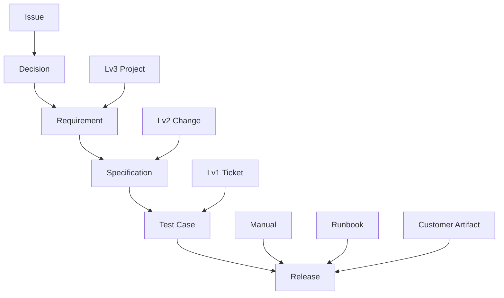
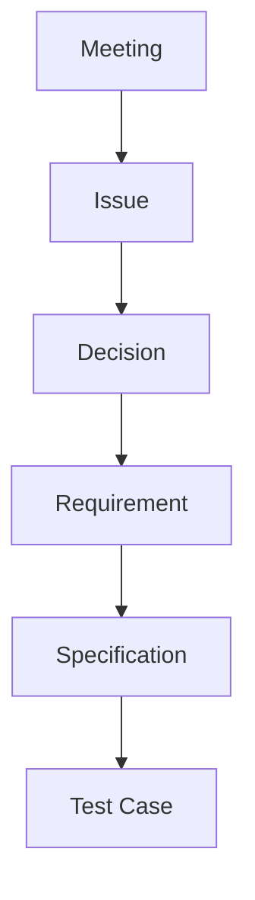

# README Project

この文書は、プロジェクト管理と文書トレーサビリティ運用の全体設計を定義します。

## 1. 基本方針

- 1項目1ファイルで管理する
- front matter は最小限のリンクだけ持つ
- 関係は上位 -> 下位の一方向で管理する
- フェーズを跨ぐ無差別リンクは避ける

## 2. フェーズモデル



## 2.1 Meeting はどこに書くか

- 保存先: `docs/50_meetings/YYYY/MEETING-YYYYMMDD-001.md`
- 種別: `meeting_note`（ID プレフィックス: `MEETING`）
- 記録内容: 目的、議題、決定事項、次アクション

## 2.2 Meeting からどうつながるか

Meeting は起点情報として扱い、次の接続を基本にします。



- 原則: Meeting から直接 Specification/Test に飛ばさない
- 例外: 緊急対応で議事録から即対応が必要な場合のみ、Issue を同日作成して追従させる

## 3. strict-phase ルール

検証スクリプトの strict モードでは、以下の必須リンクを 1 つ以上要求します。

- issue: decisions
- decision: requirements
- requirement: specifications
- specification: tests
- ticket_level1: tests
- change_level2: specifications
- mod_project: requirements

実行例:

```bash
node .tools/scripts/project/validate.mjs --strict-phase
node .tools/scripts/project/validate.mjs 001_blueberry_system --strict-phase
node .tools/scripts/project/validate.mjs "docs/10_specs/product_baseline/SPEC-2026-001.md" --strict-phase
```

## 3.1 共通 front matter 項目

新しい docs-first 系の文書では、`status`、`visibility`、`owner` を運用判断の軸として使います。

### status

標準系の文書で使う値:

- `draft`: 作成直後。内容は未確定で、レビュー前
- `review`: 内容は書いたが、関係者確認待ち
- `approved`: 合意済み。基準として参照してよい
- `active`: 現在運用中。日常参照の主役
- `deprecated`: まだ残すが、新規参照先にはしない
- `closed`: 役目が終わり、追記運用もしない

付けるタイミングと意図:

- 作成時: 原則 `draft`
- レビュー依頼時: `review`
- 合意・採用時: `approved`
- 実運用に入った時: `active`
- 後継文書へ移した時: `deprecated`
- 変更・追記を止めて保管だけにする時: `closed`

使い分けの意図:

- `approved` は「内容が妥当」
- `active` は「今の現場で使う基準」
- つまり、承認されたがまだ未投入の文書は `approved` のままでもよい

補足:

- 旧互換スキーマ（`source`, `task_impl`, `spec_internal` など）は `000_schema/document/schemas/_legacy` に退避している
- 新規作成では、原則として上記 6 値を使う文書種別を優先する

### visibility

使う値:

- `internal`: 社内のみ。通常の設計・課題・運用文書
- `customer`: 顧客へそのまま見せる前提
- `partial`: 一部転用可。社内文書だが抜粋利用あり
- `confidential`: 強い秘匿対象。権限を絞る

付けるタイミングと意図:

- 作成時に必ず決める
- 文書の内容ではなく、公開範囲と転用方針を明示するために付ける
- 迷ったら `internal` を初期値にし、公開用途が固まった時点で見直す

判断の目安:

- 顧客合意文書、提出物、配布マニュアル: `customer`
- 社内で作るが、顧客向け資料に転記する可能性あり: `partial`
- 認証、運用権限、障害対応、個人情報周辺: `confidential` を検討

### owner

意味:

- 文書の責任窓口。必ずしも作成者と一致しない

付けるタイミングと意図:

- 作成時に決められるなら担当者名を入れる
- 未決なら `TBD` で開始し、レビュー段階までに確定する
- 更新が必要になった時に「誰へ確認するか」を明確にするために使う

運用ルール:

- 個人名、担当ロール、チーム名のいずれでもよい
- ただし同一プロジェクトでは表記を揃える
- 放置防止のため、`approved` 以降は空欄にしない

### 実務上の初期値

迷った場合の初期値は次の通り。

| 項目       | 初期値     | 使う場面               |
| ---------- | ---------- | ---------------------- |
| status     | `draft`    | 新規作成直後           |
| visibility | `internal` | 社内検討から始める場合 |
| owner      | `TBD`      | 担当窓口が未確定の時   |

### 種別ごとの考え方

- `issue`: 調査開始時は `active` でもよい。未着手メモではなく、課題として扱うため
- `decision`: 採用した時点で `approved`、運用基準なら `active`
- `requirement` / `specification`: 作成時 `draft`、レビュー依頼で `review`、採用後 `approved` または `active`
- `meeting_note`: 会議直後は `draft`、議事録確定後に `approved` か `active`
- `runbook` / `manual`: 実運用に使い始めたら `active`
- `release_note`: 事前整理中は `draft`、リリース確定後 `closed` でもよい

## 4. 関連スクリプト

- プロジェクト新規作成: .tools/scripts/project/new_project.mjs
- フロントマター検証: .tools/scripts/project/validate.mjs
- ドキュメント作成: .tools/scripts/document/create.mjs
- Lv1/Lv2/Lv3 作成: .tools/scripts/document/create_levels.mjs
- 一括作成: .tools/scripts/document/batch.mjs

### create.mjs で作られるもの一覧

create.mjs は、以下の種別から 1 件を選んで作成します。

| 種別キー          | ID 例            | 保存先                                |
| ----------------- | ---------------- | ------------------------------------- |
| requirement       | REQ-2026-001     | docs/10_specs/requirements            |
| specification     | SPEC-2026-001    | docs/10_specs/product_baseline        |
| test_case         | TEST-2026-001    | docs/20_tests/master_test_cases       |
| issue             | ISSUE-2026-001   | docs/10_specs/issues                  |
| risk              | RISK-2026-001    | docs/10_specs/risks                   |
| decision          | DEC-2026-001     | docs/10_specs/decisions               |
| ticket_level1     | BUG-2026-001     | docs/10_specs/changes/level1_tickets  |
| change_level2     | CHG-2026-001     | docs/10_specs/changes/level2_changes  |
| mod_project       | MOD-2026-001     | docs/10_specs/changes/level3_projects |
| runbook           | RUNBOOK-2026-001 | docs/30_operations/runbook            |
| manual            | MANUAL-2026-001  | docs/30_operations/manual             |
| customer_artifact | CUST-2026-001    | docs/40_customer_outputs              |
| release_note      | RELEASE-2026-001 | docs/60_release                       |
| meeting_note      | MEETING-xxxx     | docs/50_meetings                      |

補足:

- create.mjs は 1 回の実行で 1 ファイルを作成
- Lv1/Lv2/Lv3 をまとめて作る場合は create_levels.mjs を使用

### VS Code スニペット

`.vscode/project-docs.code-snippets` に、以下の補助スニペットを生成しています。

- `fm.status`: status 候補を入力
- `fm.visibility`: visibility 候補を入力
- `fm.owner`: owner 行を入力
- `fm.common`: 共通 front matter の最小セットを入力

文書種別テンプレート (`doc.issue`, `doc.dec`, `doc.req`, `doc.spec` など) も、`status` / `visibility` / `owner` をそのまま補完できる形で生成されます。

Lv1/Lv2/Lv3 で実際に生成されるファイル一覧は [README_DocumentManagement.md](README_DocumentManagement.md) の「Lv1/Lv2/Lv3 で生成されるもの（詳細）」を参照してください。

## 4.1 依存ライブラリ

プロジェクト管理・検証で使用する主なライブラリ（`.tools/package.json`）:

- `ajv`: front matter の JSON Schema 検証
- `js-yaml`: front matter YAML の解析

## 5. 運用ルール

- 仕様が固まるまではテストを確定しない
- 仕様が確定したら tests を登録する
- Release 関係はリリース段階でまとめて記入する
- 手戻り時は上位フェーズから順に再整理する
